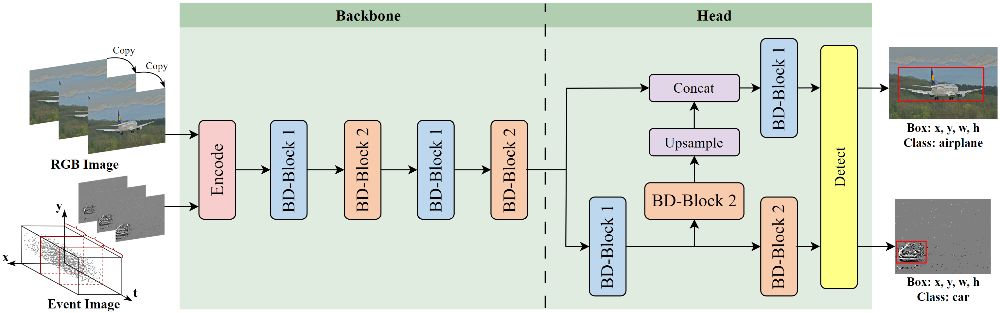

# Bidirectional Dynamic Threshold SNN for Enhanced Object Detection with Rich Pulse Information

Shaoxing Wu, Yufei Zhao, Ya Zhou, Qingzhu Meng, Yizhao Liao, Yiqian Huang, Zhu Yuan, Shuqi Liu and Yong Song

School of Optics and Photonics, Beijing Institute of Technology, Beijing

Beijing Institute of Automation and Control Equipment, Beijing

---


## Abstract

Spiking Neural Networks (SNNs), inspired by neuroscience principles, have gained attention for their energy efficiency. However, directly trained SNNs lag behind Artificial Neural Networks (ANNs) in accuracy for complex tasks like object detection due to the limited information capacity of binary pulse feature maps. To address this, we propose BD-SNN, a new directly trained SNN equipped with Bidirectional Dynamic Threshold neurons (BD-LIF). BD-LIF neurons emit +1 and -1 pulses and dynamically adjust their thresholds, enhancing the network's information encoding capacity and activation efficiency. Our BD-SNN incorporates two new all-pulse residual blocks, BD-Block1 and BD-Block2, for efficient information extraction and multi-scale feature fusion, respectively. Experiments on the COCO and Gen1 datasets demonstrate that BD-SNN improves accuracy by 3.1% and 2.8% compared to the state-of-the-art EMS-YOLO method, respectively, validating BD-SNN's superior performance across diverse input scenarios.



For help or issues using this git, please submit a GitHub issue.

For other communications related to this git, please contact `wushaoxing@bit.edu.cn` and `yongsong@bit.edu.cn`.

<details open>

## Install

```bash
$ git clone https://github.com/Ganpei576/BD-SNN.git
$ pip install -r requirements.txt
```

## Train

```python
python train.py
```

## Detect / Test

```python
python detect.py
```
</details>
